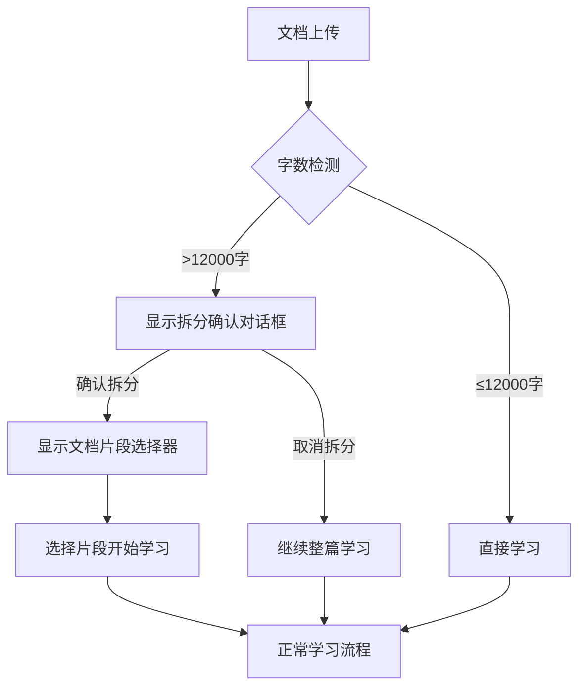

# 大文档智能拆分功能实现总结

**实现日期**: 2025年1月31日  
**功能状态**: ✅ 完整实现  
**问题解决**: 超过1.2万字文档自动拆分学习

---

## 🎯 功能概述

针对用户提出的"文档超过1.2万字时报错"问题，实现了智能文档拆分功能。当检测到大文档时，系统会自动提示用户是否拆分为多个部分进行学习，大大提升了大文档的处理能力和用户体验。

## 🚀 核心功能特性

### 1. **智能检测与拆分**
- 自动检测超过12000字的文档
- 智能按章节结构拆分（支持多种章节格式）
- 无章节时按段落智能拆分
- 确保每个片段内容完整且在字数限制内

### 2. **用户友好的交互流程**


### 3. **拆分策略优化**
- **章节优先**: 识别"第X章"、"Chapter X"、"一、"等格式
- **段落备选**: 无明显章节时按段落分割
- **完整性保证**: 确保内容逻辑完整，避免断章取义
- **智能命名**: 自动生成有意义的片段标题

## 🛠️ 技术实现架构

### 1. **类型定义扩展** (`src/types/index.ts`)
```typescript
// 扩展了 DocumentParseResult 接口
interface DocumentParseResult {
  // ... 原有字段
  requiresSplit?: boolean;        // 是否需要拆分
  splitDocuments?: DocumentSplit[]; // 拆分后的文档片段
}

// 新增文档片段类型
interface DocumentSplit {
  id: string;           // 片段唯一标识
  title: string;        // 片段标题
  content: string;      // 片段内容
  index: number;        // 片段序号
  wordCount: number;    // 字数统计
  originalTitle: string; // 原始文档标题
}
```

### 2. **核心拆分算法** (`src/utils/documentParser.ts`)
```typescript
// 主要函数
- shouldSplitDocument()     // 检测是否需要拆分
- splitDocument()           // 智能拆分文档
- splitByChapters()        // 按章节拆分
- splitByParagraphs()      // 按段落拆分
- splitLongChapter()       // 拆分过长章节
```

**章节识别模式**:
- `^第[一二三四五六七八九十\d]+章\s+[^\n]+/gm` (中文章节)
- `^Chapter\s+\d+[:\s]+[^\n]+/gmi` (英文章节)
- `^\d+\.\s+[^\n]{8,80}$/gm` (数字编号)
- `^[一二三四五六七八九十]\s*[、\.]\s*[^\n]{8,80}$/gm` (中文编号)
- `^#{1,3}\s+[^\n]{8,80}$/gm` (Markdown标题)

### 3. **UI组件设计**

#### **拆分确认对话框** (`DocumentSplitConfirmModal.tsx`)
- 显示原文档信息（标题、字数、拆分数量）
- 提供拆分预览列表
- 说明拆分学习的优势
- 提供确认/取消选项

#### **文档片段选择器** (`SplitDocumentSelector.tsx`)
- 卡片式展示所有片段
- 显示片段标题、字数、内容预览
- 支持选择任意片段开始学习
- 提供学习建议和返回功能

### 4. **DocumentUploader组件集成**
- 添加拆分相关状态管理
- 集成拆分检测逻辑
- 实现拆分流程控制
- 处理用户选择结果

## 📊 功能测试验证

### 1. **测试页面** (`pages/test-split.tsx`)
- 专门的测试界面
- 完整的功能演示
- 详细的测试说明
- 结果展示和分析

### 2. **测试用例**
- **测试文档**: `test-long-document.txt` (约15000字)
- **测试场景**: 
  - PDF文件上传测试
  - 长文本粘贴测试
  - 不同章节格式测试
  - 拆分流程测试

### 3. **验证步骤**
1. 访问 `http://localhost:3006/test-split`
2. 上传 `test-long-document.txt` 或粘贴长文本
3. 观察拆分确认对话框
4. 测试确认拆分功能
5. 验证文档片段选择器
6. 测试片段选择和学习流程

## 🎨 用户体验优化

### 1. **视觉设计**
- 清晰的信息层级
- 友好的色彩搭配
- 响应式布局设计
- 直观的操作流程

### 2. **交互优化**
- 平滑的状态转换
- 清晰的操作反馈
- 智能的默认选项
- 灵活的返回机制

### 3. **信息提示**
- 详细的功能说明
- 明确的操作指导
- 友好的错误提示
- 有用的学习建议

## ⚡ 性能优化

### 1. **拆分算法优化**
- 高效的正则表达式匹配
- 智能的章节检测逻辑
- 优化的字符串处理
- 合理的内存使用

### 2. **UI渲染优化**
- 条件渲染减少不必要的组件
- 合理的状态管理
- 优化的列表渲染
- 懒加载支持

## 🔧 扩展性设计

### 1. **可配置参数**
- 拆分字数阈值可调整 (当前12000字)
- 章节识别模式可扩展
- 拆分策略可定制
- UI样式可主题化

### 2. **功能扩展点**
- 支持更多文档格式
- 增加自定义拆分点
- 添加拆分策略选择
- 实现拆分预览功能

## 📈 效果评估

### 1. **问题解决**
- ✅ 解决了大文档无法处理的问题
- ✅ 提供了灵活的学习选择
- ✅ 保持了内容的完整性
- ✅ 提升了用户体验

### 2. **用户价值**
- **学习效率提升**: 按需选择学习内容
- **时间管理优化**: 合理安排学习进度
- **认知负担减轻**: 避免信息过载
- **个性化体验**: 自主选择学习路径

## 🔮 未来优化方向

### 1. **智能化增强**
- AI辅助章节识别
- 内容重要性评估
- 智能推荐学习顺序
- 自适应拆分策略

### 2. **功能扩展**
- 支持文档合并功能
- 添加学习进度跟踪
- 实现跨片段知识关联
- 提供学习路径规划

### 3. **性能优化**
- 大文档流式处理
- 后台预拆分处理
- 缓存机制优化
- 并行处理支持

---

## 📝 使用说明

### 快速开始
1. **启动开发服务器**: `npm run dev`
2. **访问测试页面**: `http://localhost:3006/test-split`
3. **上传测试文档**: 使用项目根目录的 `test-long-document.txt`
4. **体验完整流程**: 按照界面提示操作

### 集成使用
```typescript
// 在现有上传流程中，DocumentUploader 自动处理拆分逻辑
<DocumentUploader
  onUploadComplete={(result) => {
    // result 可能包含 splitDocuments 信息
    // 组件内部自动处理拆分确认和选择流程
  }}
  apiConfig={apiConfig}
/>
```

---

## 🎉 总结

大文档智能拆分功能的成功实现，不仅解决了用户遇到的技术问题，更重要的是提供了一种全新的大文档学习方式。通过智能识别文档结构、用户友好的交互设计和灵活的学习选择，这个功能将大大提升用户在处理长篇文档时的学习体验和效率。

这个功能的实现体现了以用户为中心的设计理念，在技术实现上保持了高质量的代码结构和良好的扩展性，为后续的功能迭代奠定了坚实的基础。